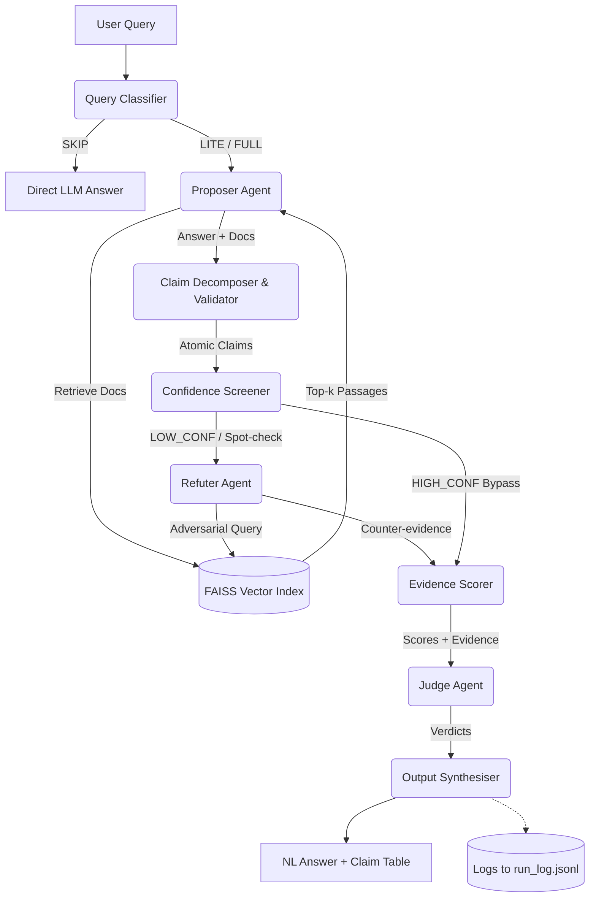
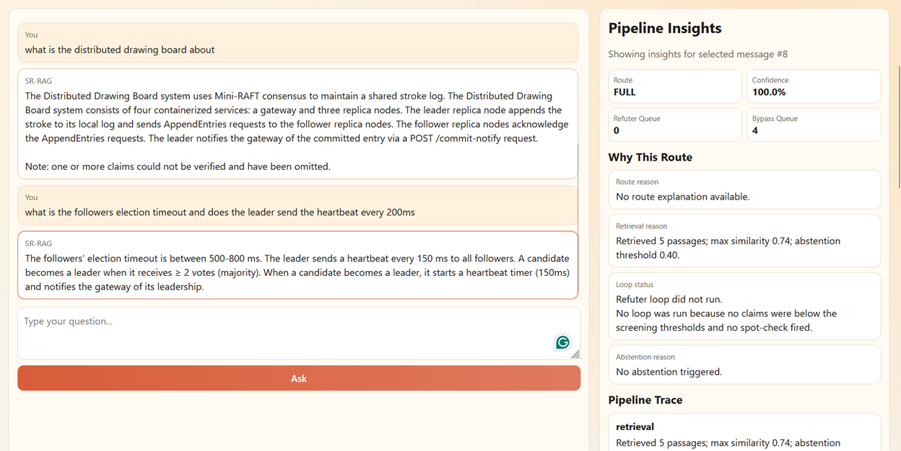
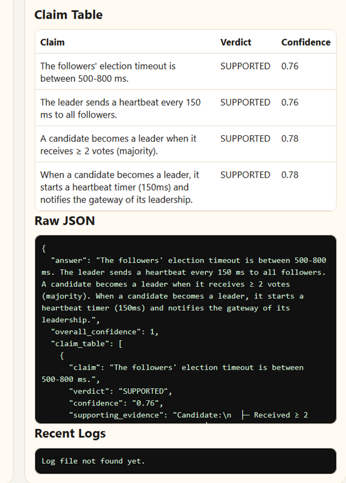

# SR-RAG: Self-Refuting Retrieval Augmented Generation

**SR-RAG** is a multi-agent question answering system designed to improve factual accuracy and transparency through claim-level adversarial verification. 

Unlike traditional whole-answer debate mechanisms, SR-RAG breaks down answers into atomic claims and selectively routes low-confidence claims to an adversarial Refuter agent constrained entirely to documentary evidence (retrieved context). A Judge agent resolves any emerging conflicts.

## Key Architectural Principles

1. **Adversarial Asymmetry:** The Refuter Agent is constrained to using retrieved documents only.
2. **Claim-Level Granularity:** Every verification, score, and verdict targets specific, individual facts.
3. **Selective Adversarial Targeting:** Dual-signal screening (LLM confidence + FAISS cosine similarity) routes low-confidence claims to the Refuter, aggressively reducing unnecessary API calls.
4. **Observability By Design:** All intermediate routing, claims, and scoring actions are captured in `logs/run_log.jsonl`.

## Architecture Diagram



## Output Screenshots





## Setup & Installation

> **Requirements:** Node.js 18+ and Python 3.9+ must be on your PATH.

### First-time setup (one command)

```bash
npm install        # installs concurrently (the only Node dev dependency)
npm run setup      # creates ./srenv venv, pip-installs requirements, installs frontend deps, copies .env
```

`npm run setup` is safe to re-run at any time — it skips steps that are already complete.

After setup, open `.env` and add your Groq API key:

```
GROQ_API_KEY=your_groq_api_key_here
```

### Start the full stack

```bash
npm start
```

This kills any stale processes on ports 8000 / 5173, then starts the backend and frontend together.  
Open **[http://localhost:5173](http://localhost:5173)** in your browser.

### Individual commands


| Command                      | What it does                                                         |
| ---------------------------- | -------------------------------------------------------------------- |
| `npm run setup`              | First-time setup (venv + pip + frontend npm install)                 |
| `npm start`                  | Start backend + frontend together                                    |
| `npm run start:logs`         | Same, but backend output also written to `logs/terminal/backend.log` |
| `npm run stop:ports`         | Kill any process on ports 8000 or 5173                               |
| `npm run backend:dev`        | Start backend only                                                   |
| `npm run backend:dev:reload` | Start backend with `--reload` (hot-reload on code changes)           |
| `npm run frontend:dev`       | Start frontend only                                                  |
| `npm run frontend:build`     | Build frontend for production                                        |


### Python environment override

The launcher auto-detects `./srenv` (created by `npm run setup`). To use a different Python:

```bash
# Windows
set PYTHON_BIN=C:\path\to\your\python.exe && npm run backend:dev

# macOS / Linux
PYTHON_BIN=/path/to/python npm run backend:dev
```

### Notes

- Frontend proxies `/api/*` to `http://127.0.0.1:8000` via Vite — no CORS config needed during development.
- Frontend is pinned to port `5173` (strict). If the port is occupied, run `npm run stop:ports` first.
- Backend defaults to FAISS `IndexFlatIP` (stable single-threaded). Override with `SR_RAG_FAISS_INDEX=hnsw` for HNSW approximate search on large corpora.
- Thread counts for OpenMP / BLAS / MKL are all pinned to 1 by the launcher to prevent native library conflicts on all platforms.

The UI shows:

- chat response
- route used (`SKIP`/`LITE`/`FULL`)
- refuter queue size (how many claims entered loop)
- bypass queue size
- claim table when available
- route, retrieval, abstention, and loop explanations
- uploaded document status and active corpus size

### Upload a Document

Use the upload control in the chat UI to replace the active corpus with a new `.txt`, `.md`, `.json`, `.jsonl`, or `.csv` file. The backend rebuilds the index immediately and the next question will run against the uploaded content.

### Use Your Downloaded Dataset

The default corpus is a small built-in sample. To run with your own dataset, activate the venv and set environment variables before running the tests.

**Windows (PowerShell):**

```powershell
.\srenv\Scripts\Activate.ps1
$env:E2E_DATA_FILE = "C:\absolute\path\to\your_dataset.jsonl"
$env:E2E_TEXT_FIELDS = "text,content,document"
$env:E2E_MAX_DOCS = "500"
python tests/test_e2e.py
```

**macOS / Linux:**

```bash
source srenv/bin/activate
E2E_DATA_FILE="/absolute/path/to/your_dataset.jsonl" \
E2E_TEXT_FIELDS="text,content,document" \
E2E_MAX_DOCS=500 \
python tests/test_e2e.py
```

Supported local formats: `.txt`, `.csv`, `.json`, `.jsonl`, `.parquet`

You can also use a Hugging Face dataset directly:

**Windows (PowerShell):**

```powershell
.\srenv\Scripts\Activate.ps1
$env:E2E_DATASET_NAME = "truthful_qa"
$env:E2E_DATASET_SPLIT = "validation"
$env:E2E_TEXT_FIELDS = "question"
python tests/test_e2e.py
```

**macOS / Linux:**

```bash
source srenv/bin/activate
E2E_DATASET_NAME="truthful_qa" E2E_DATASET_SPLIT="validation" E2E_TEXT_FIELDS="question" python tests/test_e2e.py
```

To use all three FaithEval datasets together (Windows PowerShell):

```powershell
.\srenv\Scripts\Activate.ps1
$env:E2E_DATASET_NAMES = "Salesforce/FaithEval-inconsistent-v1.0,Salesforce/FaithEval-counterfactual-v1.0,Salesforce/FaithEval-unanswerable-v1.0"
$env:E2E_DATASET_SPLIT = "test"
$env:E2E_TEXT_FIELDS = "question,context,text"
$env:E2E_MAX_DOCS = "900"
python tests/test_e2e.py
```

## Project Structure

- `agents/`: Contains the LLM interaction agents (`classifier.py`, `proposer.py`, `refuter.py`, `judge.py`).
- `pipeline/`: Pure Python control and validation processes (Decomposer, Screener, Scorer, Synthesiser, Logger).
- `retrieval/`: Wrappers for `faiss-cpu` and `sentence-transformers/all-MiniLM-L6-v2`.
- `prompts/`: Contains explicit, version-controlled `.txt` prompt instructions.
- `models.py`: Strict DataClasses enforcing schema.
- `config.yaml`: External threshold and runtime configurations.