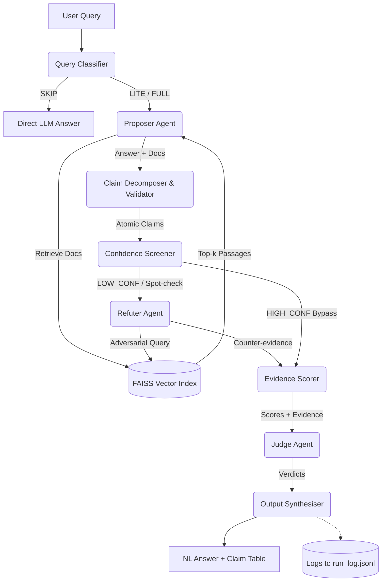

# SR-RAG: Self-Refuting Retrieval Augmented Generation

**SR-RAG** is a multi-agent question answering system designed to improve factual accuracy and transparency through claim-level adversarial verification. 

Unlike traditional whole-answer debate mechanisms, SR-RAG breaks down answers into atomic claims and selectively routes low-confidence claims to an adversarial Refuter agent constrained entirely to documentary evidence (retrieved context). A Judge agent resolves any emerging conflicts.

## Key Architectural Principles
1. **Adversarial Asymmetry:** The Refuter Agent is constrained to using retrieved documents only.
2. **Claim-Level Granularity:** Every verification, score, and verdict targets specific, individual facts.
3. **Selective Adversarial Targeting:** Dual-signal screening (LLM confidence + FAISS cosine similarity) routes low-confidence claims to the Refuter, aggressively reducing unnecessary API calls.
4. **Observability By Design:** All intermediate routing, claims, and scoring actions are captured in `logs/run_log.jsonl`.

## Architecture Diagram



## Setup & Installation

1. Install requirements:
```bash
pip install -r requirements.txt
```

2. Duplicate `.env.example` to `.env` and fill in your Groq API key:
```bash
cp .env.example .env
```

3. Run end-to-end tests:
```bash
python tests/test_e2e.py
```

## Project Structure
- `agents/`: Contains the LLM interaction agents (`classifier.py`, `proposer.py`, `refuter.py`, `judge.py`).
- `pipeline/`: Pure Python control and validation processes (Decomposer, Screener, Scorer, Synthesiser, Logger).
- `retrieval/`: Wrappers for `faiss-cpu` and `sentence-transformers/all-MiniLM-L6-v2`.
- `prompts/`: Contains explicit, version-controlled `.txt` prompt instructions.
- `models.py`: Strict DataClasses enforcing schema.
- `config.yaml`: External threshold and runtime configurations.
