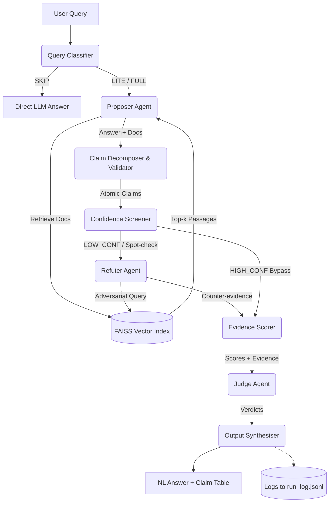

# SR-RAG: Self-Refuting Retrieval Augmented Generation

**SR-RAG** is a multi-agent question answering system designed to improve factual accuracy and transparency through claim-level adversarial verification. 

Unlike traditional whole-answer debate mechanisms, SR-RAG breaks down answers into atomic claims and selectively routes low-confidence claims to an adversarial Refuter agent constrained entirely to documentary evidence (retrieved context). A Judge agent resolves any emerging conflicts.

## Key Architectural Principles
1. **Adversarial Asymmetry:** The Refuter Agent is constrained to using retrieved documents only.
2. **Claim-Level Granularity:** Every verification, score, and verdict targets specific, individual facts.
3. **Selective Adversarial Targeting:** Dual-signal screening (LLM confidence + FAISS cosine similarity) routes low-confidence claims to the Refuter, aggressively reducing unnecessary API calls.
4. **Observability By Design:** All intermediate routing, claims, and scoring actions are captured in `logs/run_log.jsonl`.

## Architecture Diagram



## Setup & Installation

1. Install requirements:
```bash
pip install -r requirements.txt
```

2. Duplicate `.env.example` to `.env` and fill in your Groq API key:
```bash
cp .env.example .env
```

3. Run end-to-end tests:
```bash
python tests/test_e2e.py
```

## Interactive Chat App (API + React UI)

This project now includes an interactive chat that uses the same SR-RAG pipeline logic per message:
- route classification (`SKIP`, `LITE`, `FULL`)
- retrieval + abstention check
- confidence screening + optional refuter loop
- judging + synthesis

### 1) Start backend API

```bash
uvicorn chat_api:app --host 0.0.0.0 --port 8000 --reload
```

Or start both backend + frontend from project root:

```bash
npm install
npm start
```

If startup fails due occupied ports, run:

```bash
npm run stop:ports
```

To save terminal logs while running both services:

```bash
npm run start:logs
```

Log files:
- `logs/terminal/backend.log`
- `logs/terminal/frontend.log`

Follow logs live from another terminal:

```bash
npm run logs:tail
```

You can also inspect recent backend logs inside the app at `/api/logs` via the right-hand panel.

### 2) Start React frontend

```bash
cd frontend
npm install
npm run dev
```

Open `http://localhost:5173`.

Note:
- Frontend calls `/api/*` through Vite proxy to backend `http://127.0.0.1:8000`.
- Frontend uses strict port `5173`; if that port is occupied, dev server exits so you can free the port instead of silently switching.
- Default backend start uses no `--reload` for stability on macOS. If you need hot reload, use `npm run backend:dev:reload`.
- Backend defaults to FAISS `IndexFlatIP` and single-threaded native libs for macOS stability.
    You can override to HNSW manually with `SR_RAG_FAISS_INDEX=hnsw`.
- If your machine has duplicate OpenMP runtimes, startup scripts set `KMP_DUPLICATE_LIB_OK=TRUE`
    to prevent abort during FAISS/ML native library initialization.

The UI shows:
- chat response
- route used (`SKIP`/`LITE`/`FULL`)
- refuter queue size (how many claims entered loop)
- bypass queue size
- claim table when available
- route, retrieval, abstention, and loop explanations
- uploaded document status and active corpus size

### Upload a Document

Use the upload control in the chat UI to replace the active corpus with a new `.txt`, `.md`, `.json`, `.jsonl`, or `.csv` file. The backend rebuilds the index immediately and the next question will run against the uploaded content.

### Use Your Downloaded Dataset

The default E2E test uses a tiny 3-document sample. To run with your own dataset, set environment variables before running:

```bash
export E2E_DATA_FILE="/absolute/path/to/your_dataset.jsonl"
export E2E_TEXT_FIELDS="text,content,document"
export E2E_MAX_DOCS=500
python tests/test_e2e.py
```

Supported local formats: `.txt`, `.csv`, `.json`, `.jsonl`, `.parquet`

You can also use a Hugging Face dataset directly:

```bash
export E2E_DATASET_NAME="truthful_qa"
export E2E_DATASET_SPLIT="validation"
export E2E_TEXT_FIELDS="question"
python tests/test_e2e.py
```

To use all three FaithEval datasets together:

```bash
export E2E_DATASET_NAMES="Salesforce/FaithEval-inconsistent-v1.0,Salesforce/FaithEval-counterfactual-v1.0,Salesforce/FaithEval-unanswerable-v1.0"
export E2E_DATASET_SPLIT="test"
export E2E_TEXT_FIELDS="question,context,text"
export E2E_MAX_DOCS=900
python tests/test_e2e.py
```

## Project Structure
- `agents/`: Contains the LLM interaction agents (`classifier.py`, `proposer.py`, `refuter.py`, `judge.py`).
- `pipeline/`: Pure Python control and validation processes (Decomposer, Screener, Scorer, Synthesiser, Logger).
- `retrieval/`: Wrappers for `faiss-cpu` and `sentence-transformers/all-MiniLM-L6-v2`.
- `prompts/`: Contains explicit, version-controlled `.txt` prompt instructions.
- `models.py`: Strict DataClasses enforcing schema.
- `config.yaml`: External threshold and runtime configurations.
